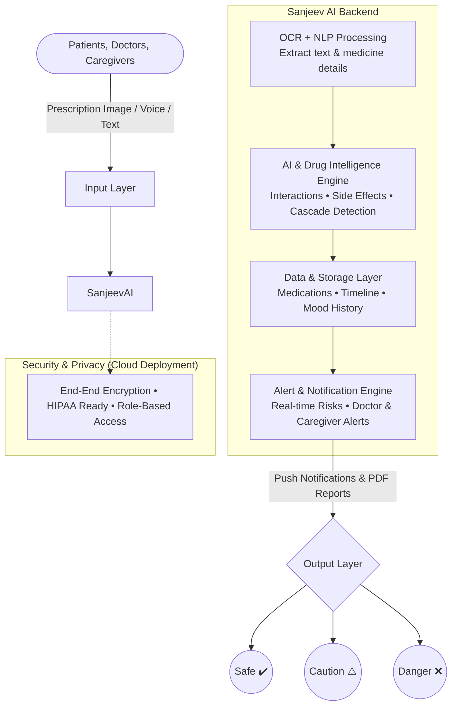
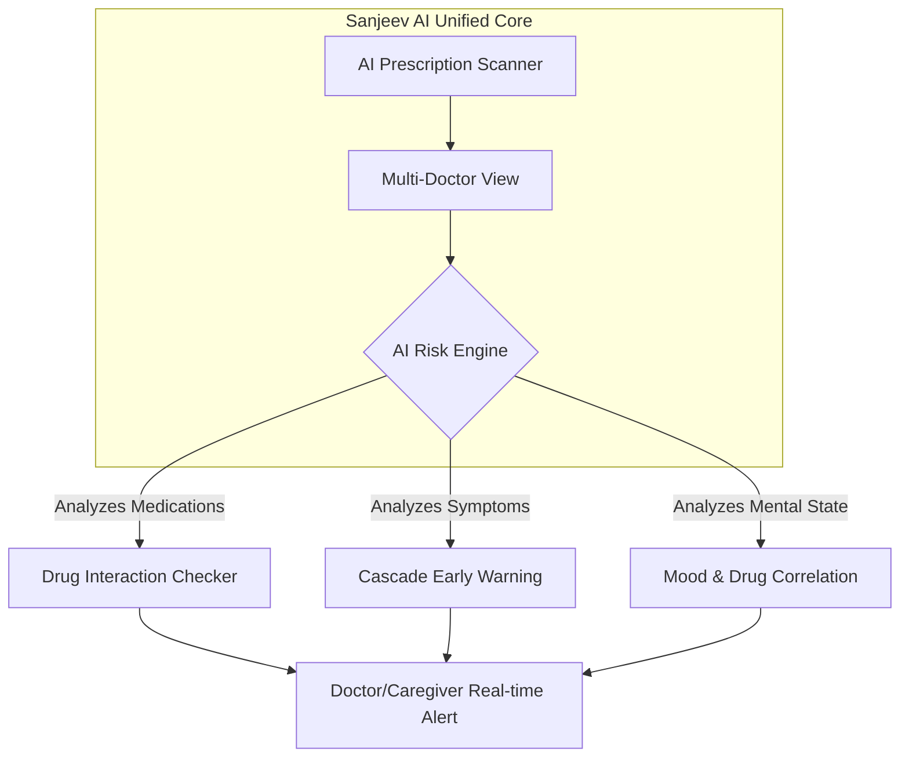

<div align="center">
  <h1>Sanjeev AI</h1>
  <p><b>An AI-Powered Platform that unifies your medications + mental health</b></p>
  
  
  
  
  

  <br />
  <br />

  <p><i>Presented at AI UTKARSH 2026 - AI SUMMIT • Narula Institute of Technology (NiT) • Theme: Responsible AI</i></p>

  <p>
    <a href="#-problem-statement">Problem Statement</a> •
    <a href="#%EF%B8%8F-architecture">Architecture</a> •
    <a href="#%E2%9A%99%EF%B8%8F-key-features">Key Features</a> •
    <a href="#-impact-and-benefit">Impact</a>
  </p>
</div>

---

## 📖 What is Sanjeev AI?

Patients today consult multiple doctors independently, receiving new medications without a unified safety net. Dangerous drug combinations often go unnoticed, medication side effects are mistaken as *new* illnesses ("Prescription Cascades"), and the mental health effects of these drugs are completely ignored. 

**Sanjeev AI** is an intelligent safety layer that connects your physical medications with your mental health. By building a multi-doctor unified view, it actively prevents hidden risks before they become critical.

---

## 🚨 Problem Statement

| The Silent Health Crisis |
| --- |

1. **No Cross-Checking:** Doctors prescribe medications in silos; no system checks cross-doctor drug interactions.
2. **Ignored Mental Health:** Mental health side effects derived from physical medications are completely ignored.
3. **Prescription Cascades:** Medication side effects are often misdiagnosed as new illnesses, leading to unnecessary and dangerous additional prescriptions.

*Result: Silent health risks, delayed diagnosis, and avoidable harm.*

---

## 🏗️ Architecture

### System Flow


---

## ⚙️ Key Features



- 📸 **AI-Powered Prescription Scanner (ClearScript Engine):** Convert messy doctor handwriting into clean, readable digital prescriptions. Features a **Three-Layer OCR Confidence System**:
  - `>90% Match`: Auto-accepted processing
  - `60% - 90% Match`: Prompts user for manual confirmation/edit
  - `<60% Match`: Forces manual fallback input
- 👨‍⚕️ **Multi-Doctor Unified View:** Merge prescriptions from *all* your doctors into one comprehensive list.
- ⚠️ **Cascade Early Warning:** Detect automatically if a newly prescribed medicine is actually just treating an old drug's side effect.
- 😊 **Mood & Drug Interaction Alerts:** Detect depression/anxiety accurately linked to the start dates of specific medications.

---

## 👥 Target Users

| User | Main Need | Key Feature |
| --- | --- | --- |
| **Patient** | Safety | Interaction checker + ClearScript |
| **Doctor** | Information | Alerts + Reports |
| **Caregiver** | Monitoring | Dashboard + SOS |
| **Pharmacist**| Clarity | ClearScript |
| **Hospital / Clinic** | Management | Full platform (Integrates with existing systems, monitors multiple patients, reduces adverse drug event rates) |

> **💡 Pitch Strategy:** Lead with the **PATIENT** — specifically elderly patients. *Nobody in their life — not their doctors, not their family — has a 100% unified view of their daily biochemical intake.*

---

## 💡 Impact and Benefit

Transforming patient safety, healthcare decisions, and lives:

| Metric | Improvement | Description |
| --- | --- | --- |
| **Patient Safety** | `↑ 90%` | Prevents dangerous drug interactions & adverse side effects. |
| **Early Detection**| `↑ 80% Faster` | Identifies prescription cascades before they escalate. |
| **Mental Wellness**| `↑ 60% Tracked`| Understands mood changes directly linked to medications. |
| **Healthcare Costs**| `↓ 35%` | Reduces hospital visits & emergency cases. |

- **Empowered Doctors:** Get complete history across all patients & prescriptions.
- **Sustainable Healthcare:** Step towards sustainable healthcare by reducing overmedication & antibiotic misuse.

---

## 🔧 Technical Approach

### Technology Stack Used & Proposed

| Layer | Technologies |
| --- | --- |
| **Frontend Prototype** | HTML5, CSS3, Vanilla JS, Vite |
| **Proposed Frontend** | React, Next.js, Tailwind CSS |
| **Backend** | Python, FastAPI, Node.js |
| **AI / Machine Learning**| TensorFlow, PyTorch, Scikit-learn |
| **OCR** | Tesseract, Google Vision API |
| **Database & Cloud** | MongoDB, PostgreSQL, Firebase, AWS |
| **Notifications** | Firebase Cloud Messaging, REST APIs |

---

## 📚 Research & References

Built on validated, trusted research from leading health organizations:

- **ScienceDirect:** Drug interactions contribute to 30%+ of adverse drug reactions.
- **NCBI / PubMed:** Interaction risk increases to 80%+ with multiple drugs.
- **Springer:** Up to 37% of prescriptions contain dangerous interactions.
- **FDA:** Adverse drug reactions cause serious hospitalizations & deaths.

*Trusted Sources: WHO Pharmacovigilance Reports, FDA Drug Safety Data, Springer & Nature Medical Studies.*

---

## 🚀 Quick Start (Frontend Prototype)

### 1. Clone Repo
```bash
git clone https://github.com/sohansarkar07/Sanjeev.AI.git
cd Sanjeev.AI
```

### 2. Install Dependencies
```bash
npm install
```

### 3. Start Development Server
```bash
npm run dev
```

### 4. Open Application
Navigate to `http://localhost:3000` to view the comprehensive UI/UX consisting of the Unified Dashboard, Prescription Scanner, Health Timeline, Risk Analysis, Mood Tracker, and Caregiver Hub.

---

## 📄 License

MIT

<br />
<div align="center">
  <b>Built for AI UTKARSH 2026 • Innovation with Integrity</b>
</div>